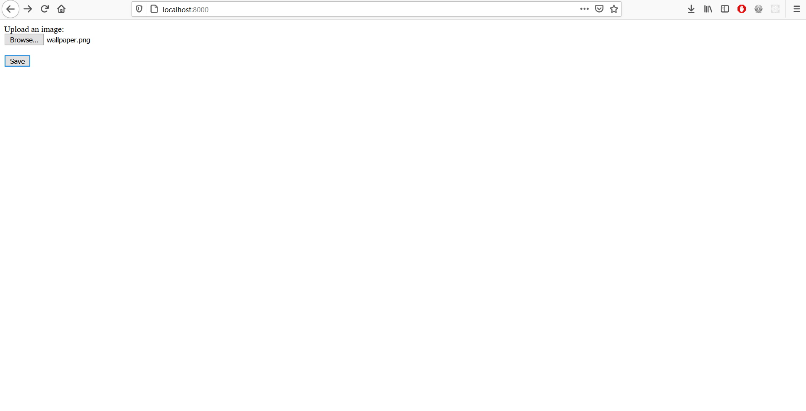
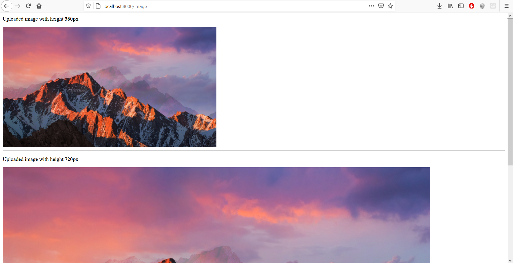

# Save image in 2 sizes on S3 bucket

Technologies: 
* Docker
* OpenFaas
* AWS S3
* Expressjs
* Nodejs

Run the local expressjs server using `docker-compose up` command.
Navigate to localhost:8000
Functionalities:
* Insert an image and press Save
* You will then see two images that were uploaded on the s3 bucket. Images are saved with height of 720px and 360px.

| Upload an image     | See saved images on your s3 bucket    | 
|------------|-------------|
|  | |
